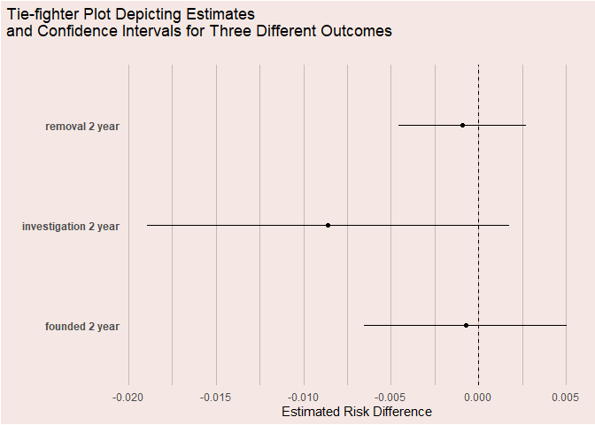

# APEVIZ

a suite of data visualization functions I’ve used in causal effect
estimation for program evaluation

## Installation

### create_plot_metadata()

This function is mostly used as a part of the create_love_plot()
function, however I’ve made it available to use on it’s own as well. It
takes in a matchit object (from the MatchIt package) and returns a
tibble that includes a column for each variable in the data used by
MatchIt, a column for the standard mean difference between the treatment
and control group in the unmatched sample, and a column for the standard
mean difference between the treatement and control group in the matched
sample.

``` r
# Load the MatchIt package
library(APEVIZ)
library(MatchIt)
library(tidyverse)

# Load the Lalonde Dataset 
data("lalonde", package = "MatchIt")

# Create a MatchIt object using the matchit() function
m.out <- matchit(treat ~ age + educ + race + married + nodegree + re74 + re75,
                 data = lalonde,
                 distance = "mahalanobis",
                 replace = TRUE)

create_plot_metadata(m.out)
```

    ## # A tibble: 9 × 3
    ##   covariate  unmatched_std_mean_diff matched_std_mean_diff
    ##   <chr>                        <dbl>                 <dbl>
    ## 1 age                        -0.309               3.55e- 2
    ## 2 educ                        0.0550             -4.03e- 2
    ## 3 raceblack                   1.76                1.11e-16
    ## 4 racehispan                 -0.350               0       
    ## 5 racewhite                  -1.88                0       
    ## 6 married                    -0.826               2.76e- 2
    ## 7 nodegree                    0.245              -1.11e-16
    ## 8 re74                       -0.721               6.28e- 2
    ## 9 re75                       -0.290               1.38e- 1

### create_love_plot

This function takes in a matchit object **OR** tibble in the same format
(column names included) as the output from the create_plot_metadata()
function and returns a love plot as a ggplot2 object. This function
includes many options for customization.

``` r
create_love_plot(m.out,
                 title = "Results of a mahalanobis distance match on the Lalonde Dataset",
                 subtitle = "")
```

<!-- -->

``` r
# change the order of the y axis

default <- create_love_plot(m.out,
                            title = "order_by = unmatched",
                            subtitle = "",
                            axis_text_size = 4)

matched <- create_love_plot(m.out,
                            title = "order_by = matched",
                            order_by = "matched",
                            subtitle = "",
                            axis_text_size = 1)

difference <- create_love_plot(m.out,
                               title = "order_by = difference",
                               order_by = "difference",
                               subtitle = "",
                               axis_text_size = 1)

library(patchwork)

default|matched|difference
```

<!-- -->

### create_tiefighter_plot()

the point of this function is to compare effect estimates and confidence
intervals across different models or outcomes. Currently, it only works
with binary outcomes, as it takes in glm objects by default

``` r
estimate_effects_removal2year <- glm(removal_2year ~ treated,
                                     data = matched_data,
                                     weights = weights,
                                     family = quasibinomial(link = "identity"))

effects_investigation2year <- glm(investigation_2year ~ treated,
                                  data = matched_data,
                                  weights = weights,
                                  family = quasibinomial(link = "identity"))

effects_founded2year <- glm(founded_2year ~ treated,
                            data = matched_data,
                            weights = weights,
                            family = quasibinomial(link = "identity"))

#create a names list of glm objects, remember that each item's name because it's label on the plot's y-axis.
glm_obs <- list("removal 2 year" = estimate_effects_removal2year,
                "investigation 2 year" = effects_investigation2year,
                "founded 2 year" = effects_founded2year)

create_tiefighter_plot(glm_obs,
                       x_title = "Estimated Risk Difference",
                       title = "Tie-fighter Plot Depicting Estimates\nand Confidence Intervals for Three Different Outcomes",
                       subtitle = "")
```

<!-- -->
